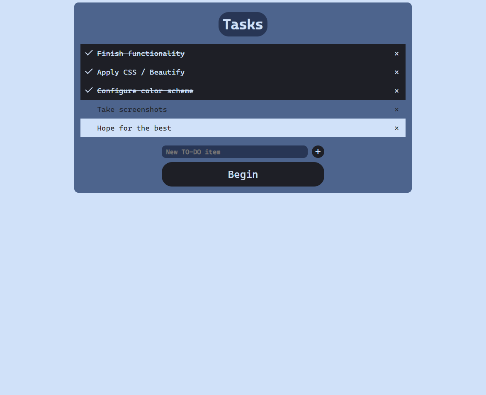

# Pomodoro-Technique

Add any task you wish to complete during your working / studying session

Mark your tasks as completed, delete them, full freedom

Work while being focused on your tasks

## The technique

1. Pick a task
2. Work on that task for ~25 minutes
3. Take a break for ~5 minutes
4. Repeat steps (2) and (3)
5. Every 4 repetitions, take a longer break (15-30 minutes)

## The program

* It automatically keeps track of time
* Notifies the user when it's time for work and breaks
* Lets the user add a To-Do list to stay focused on their goals